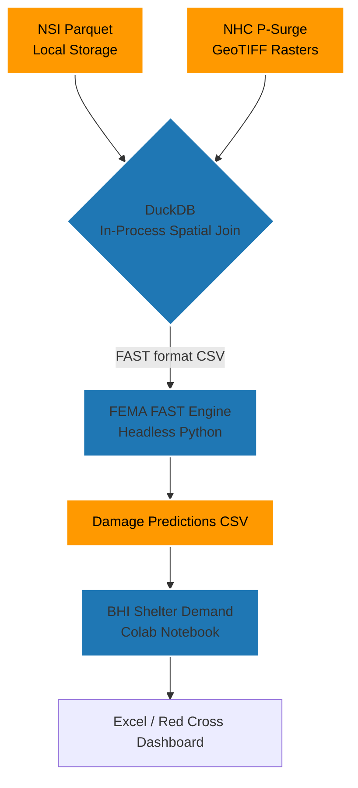

# Principal-Level Architecture Guide

Welcome to the Red Cross ARC Capstone codebase. This guide is heavily opinionated and designed for senior engineers who need to grasp the core mechanics immediately.

## The Core Architectural Insight

The core insight of this system is **converting high-precision geoinformatics algorithms into parallelizable, in-process stateless operators**.
Instead of loading 30 million NSI structures into a massive PostGIS/Oracle SQL database which forms a harsh bottleneck for spatial joins, this project aggressively uses **local Parquet files + DuckDB in-memory aggregations + Headless FEMA FAST**.

If I had to express the entire project's operational mentality in pseudocode:

```python
# Traditional approach: bottlenecked by DB transactions and complex joins
db_data = PostGIS.load("NSI_Houses_Grid")
results = db_data.spatial_join(surge_polygons).map(predict_damage)

# Our Insight (DuckDB + Parquet, local execution)
nsi_parquets = glob("data/nsi/state=*/*.parquet")
for file in nsi_parquets:
    con = duckdb.connect()
    fast_input = con.sql(f"SELECT ... FROM '{file}' WHERE lat BETWEEN ...")
    damage = fast_headless.run(fast_input, raster="nhc_psurge.tif")
    damage.to_csv("outputs/predictions.csv")
```

## Abstract Architecture and Domain Model



### Design Tradeoffs

1. **Parquet/DuckDB vs Relational DB (PostgreSQL/Oracle)**
   - *Why*: Relational databases present a bottleneck for rapid, mass-scale read/write during disaster zero-hour response loops. DuckDB executes OLAP queries extremely fast directly on local Parquet files.
   - *Tradeoff*: You lose granular single-row transactional features, but disaster evaluation is inherently a mass-batch operation.

2. **Local + Colab Execution vs Cloud Orchestrator (Airflow)**
   - *Why*: The system runs locally or on Google Colab for rapid iteration. No persistent cloud infrastructure to maintain.
   - *Tradeoff*: Lacks distributed parallelism for full-US runs, but per-event runs (single hurricane) complete in minutes locally.

## Where to Go Deep
If you only look at two scripts to understand the entire logic:
- `scripts/duckdb_fast_pipeline.py`: The heart of the extraction and formatting phase — DuckDB SQL transforms NSI Parquet → FAST CSV.
- `notebooks/shelter_demand.ipynb`: The full E2E Colab notebook from NHC advisory → tract-level shelter demand.
